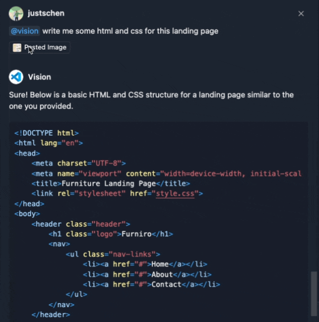

forked from https://github.com/microsoft/vscode-extension-samples

Provide your own open api key! Also make sure to set the hidden setting `"chat.experimental.imageAttachments": true`

# Example Attachment Scenarios:
1. Copy and Pasting an image from clipboard.
2. Having an image in clipboard, selecting the `Attach Context` button and selecting `Image from Clipboard` from the quick pick.
3. `Attach Context` button and selecting and image in the workspace from the quick pick.
4. Dragging and dropping from anywhere outside VS Code into the chat panel. Should also work for within VS Code. 

# Chat Example

Visual Studio Code's Copilot Chat architecture enables extension authors to integrate with the GitHub Copilot Chat experience. A chat extension is a VS Code extension that uses the Chat extension API by contributing a Chat participant. Chat participants are domain experts that can answer user queries within a specific domain.

When an extension uses the Chat or the Language Model API, we call it a GitHub Copilot Extension, since GitHub Copilot is the provider of the Chat and the Language Model experience.

This GitHub Copilot Extension sample shows:

- How to contribute a chat participant to the GitHub Copilot Chat view.
- How to use the proposed API (https://github.com/microsoft/vscode/blob/main/src/vscode-dts/vscode.proposed.chatReferenceBinaryData.d.ts) to get image data from the chat request. 
- Uses axios for an OpenAI API request.

Documentation can be found here:
- https://code.visualstudio.com/api/extension-guides/chat
- https://code.visualstudio.com/api/extension-guides/language-model

## Running the Sample

- Run `npm install` in terminal to install dependencies
- Run the `Run Extension` target in the Debug View. This will:
	- Start a task `npm: watch` to compile the code
	- Run the extension in a new VS Code window
	- You will see the @vision chat participant show in the GitHub Copilot Chat view
